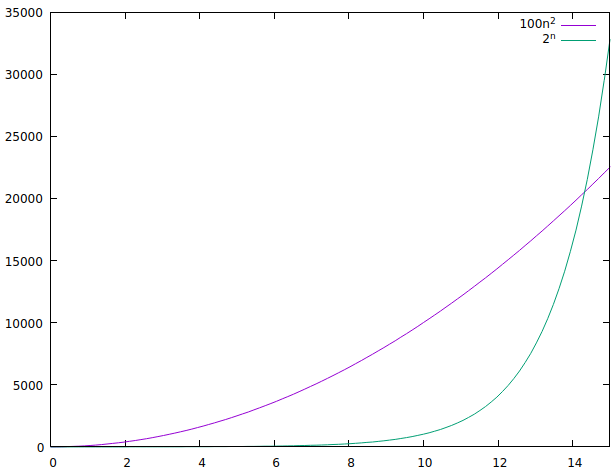

### chapter 1


1.1-1 Give a real-world example that requires sorting or a real-world example that requires computing a convex hull.  
Answer: nuclear plant leak and people around the center of this leak has to be evacuated. based on the radiation strength from the center, a convex hull can be computed and people inside the convex hull has to be evacuated.  

1.1-2 Other than speed, what other measures of efficiency might one use in a real-world setting?  
Answer: efficiency could be memory efficiency for example, computation speed may not be that important for a regular offline computing, but if it computes daily with large amount of data, memory is more important.  

1.1-3 Select a data structure that you have seen previously, and discuss its strengths and limitations.  
Answer: an array has strength of access each element by index in constant time, the limitation is deleting elements cost linear time.  

1.1-4 How are the shortest-path and traveling-salesman problems given above similar? How are they different?  
Answer: TSP is to find a path contains permutation of all nodes which is a cycle (Hamilton cycle), SP is a subset of all nodes and require each node is at most pass through once. TSP is NP-complete problem while SP is polynomial time.  

1.1-5 Come up with a real-world problem in which only the best solution will do. Then come up with one in which a solution that is “approximately” the best is good enough.  
Answer: sort products by prices and find the best price. approximately the best would be ranking recommended products to customers.  

1.2-1 Give an example of an application that requires algorithmic content at the application level, and discuss the function of the algorithms involved.  
Answer: sort products by price to customers. algorithms are sorting  

1.2-2 Suppose we are comparing implementations of insertion sort and merge sort on the same machine. For inputs of size $n$, insertion sort runs in $8n^2$ steps, while merge sort runs in $64nlgn$ steps. For which values of n does insertion sort beat merge sort?  
Answer: to beat merge sort  
```math
8n^2 <= 64nlgn  
8n <= 64lgn  
n <= 8lgn  
n/8 <= lgn  
```
where if $n \in [2, 43]$

1.2-3 What is the smallest value of $n$ such that an algorithm whose running time is $100n^2$ runs faster than an algorithm whose running time is $2^n$ on the same machine?  



